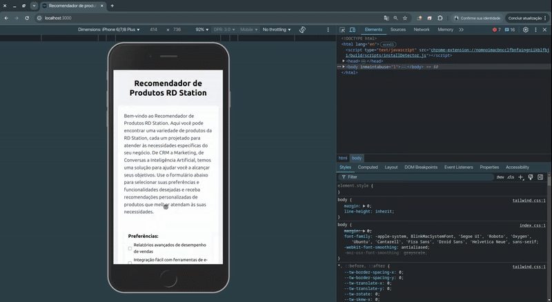

# Recomendador de Produtos RD Station - Frontend

Este projeto é a interface front-end de um **Recomendador de Produtos RD Station**, desenvolvido em React com Tailwind CSS. O objetivo é permitir que usuários selecionem preferências e funcionalidades desejadas e recebam recomendações personalizadas de produtos RD Station.

## Versão do Node.js

Este projeto requer Node.js versão 18.3 ou superior.

## Como Executar

1. Clone o repositório: `git clone git@github.com:victorevh/frontend.git`
2. Instale as dependências: `yarn install` 
3. Inicie a aplicação com mock (desenvolvimento isolado): `yarn dev`
4. Inicie integrado à API real: `yarn start`

## Scripts

O projeto possui dois scripts principais de execução:

### `yarn dev`
- Inicia o front-end usando mock local (mocks/mockProducts.js) para desenvolvimento isolado.

- O cross-env foi adicionao como dev dependecy para garantir funcionamento multiplataforma (Windows, Linux, Mac).

> ⚠️ O script dev define REACT_APP_USE_MOCK=true usando cross-env, que permite ao front-end consumir os dados do mock sem alterar a lógica de produção

### `yarn start`

- Inicia o front-end **coletando dados do endpoint real** (`http://localhost:3001/products`).
- Use este comando para integrar com a API real.

### `yarn test`

- Executa os testes unitários

## Demonstração


## Algoritmo de Recomendação

> A geração da recomendação é orquestrada em `recommendation.service.js` onde todas as etapas mencionadas abaixo são executadas

1. Cálculo de score:

    - Cada produto recebe um score baseado em quantas preferências e features do formulário ele atende. 
    - Está implementado em `score.service.js`.

2. Mapeamento e filtragem de produtos relevantes:
    
    - O score é atribuido ao produto através do map
    - Produtos com score > 0 são considerados relevantes.

3. Estratégias de recomendação:

    - **SingleProduct**: Retorna apenas o produto com maior score. Em caso de empate, retorna o último produto.

    - **MultipleProducts**: Retorna todos os produtos relevantes ordenados pelo ID.

## Estrutura do projeto
```
src/
├─ components/
│ ├─ Form/ # Componente do formulário
│ ├─ FormError/ # Componente de erro reutilizável
│ ├─ RecommendationList/ # Lista de recomendações com links
| └─ shared/ # Componente de checkbox
├─ constants/
| └─ recommendationLinks.js/ # Links dos produtos recomendados
├─ hooks/
| ├─ useErrorForm.js # Gerenciamento de erros
| ├─ useForm.js # Gerenciamento do formulário
│ ├─ useProducts.js # Gerenciamento para produtos
│ └─ useRecommendations.js# Gerenciamento das recomendações/loading
│ └─ mockProducts.js # Produtos mockados para desenvolvimento isolado
├─ services/
│ ├─ recommendation/
| | ├─ strategies
| | | ├─ multipleProducts.strategy.js # Recomendação múltipla
| | | ├─ multipleProducts.strategy.test.js # Teste unitário
| | | ├─ singleProduct.strategy.js# Recomendação única
| | | └─ singleProduct.strategy.test.js # Teste unitário
│ | ├─ recommendation.service.js # Orquestra lógica de recomendação
│ | ├─ recommendation.service.test.js # Teste unitário
│ | ├─ score.service.js # Incrementa pontuação
│ | └─ score.service.js # Teste unitário
│ └─ product.service.js # Define endpoint do produto
└─ App.js # Raiz da aplicação
```

## Boas práticas implementadas

- Modularização de hooks e serviços.
- Componentes reutilizáveis e desacoplados.
- Mensagens de erro e loading consistentes.
- Responsividade e usabilidade em múltiplos dispositivos.
- Testes unitários cobrindo cálculo de score e estratégias de recomendação.
- URLs de produtos centralizadas para manutenção fácil.

## 📄 Licença
Este projeto está licenciado sob a licença MIT - veja o arquivo [LICENSE](LICENSE) para detalhes.

## Sobre o editor

**Victor Santos**  
[LinkedIn](https://www.linkedin.com/in/victor-oliveira-santos-b10bb81ab/) · [Email](mailto:victorevh@gmail.com)

---
